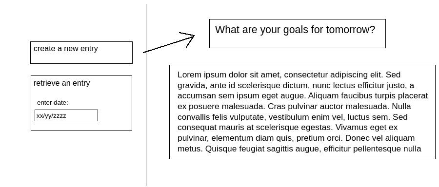

# *Enhance!* Design Document

## 1. Problem Statement

Habitual and effective journaling has been shown to be associated with significant
improvements in working memory and the ability to identify useful fact-patterns
in one's behavior and environment. With the aim of capturing these benefits, this 
design document describes a web-based journaling app intended to specifically maximize 
the memory capacity and pattern-analysis returns on journaling-time investment.

## 2. Use Cases

U1. As a customer, I want to write a journal entry in response to writing prompts. 

U2. As a customer, I want to access a specific journal entry by date.

## 3. Project Scope

### 3.1 In Scope
- Creating a journal entry given a pre-defined set of prompts
- Retrieve an entry by date

### 3.2 Out of Scope
- Editing a stored journal entry
- Editing or adding custom writing prompts
- Searching through all entries for patterns and key-words

## 4. Proposed Architecture Overview

This initial iteration will provide the minimum lovable product (MLP) including creating as well as retrieving a journal entry.

We will use API Gateway and Lambda to create two endpoints (GetEntry and CreateEntry) that will handle the creation and retrieval of journal entries to satisfy our requirements.

We will store journal entries in a table in DynamoDB.

*Enhance!* will also include a web interface to guide users in the creation and retrieval of journal entries. 
A main page will allow users to input a date to view a previous entry and link to a page where they can compose a new entry.

## 5. API

### 5.1. Public Models

```
// EntryModel

String userId;
String date;
String entry;
```

### 5.2. *Get Entry Endpoint*

Accepts `GET` requests to `/entries/userId/date`
Accepts a user ID and date and returns the corresponding entry.
If an entry for the given date is not found, will throw a `EntryNotFoundException`.

### 5.3 *Create Entry Endpoint*
Accepts `POST` requests to `/entries/userId`
Accepts data to create a new entry associated with the provided user ID and the date at the moment the request is made. 
Returns the new entry. If the user ID is invalid, throws an `InvalidUserIdException`. If an entry with the given date already exists,
throws a `DuplicateEntryException`.


## 6. Tables

### 6.1 `entries`
```
// entries
userId // partition key, string
date // sort key, string
entry // string
```

## 7. Pages


